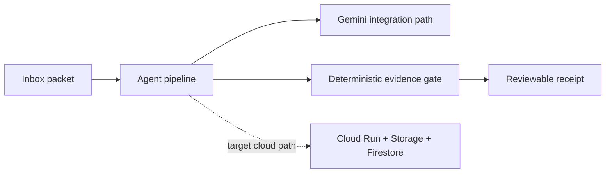

# Night Clerk

**Evidence-gated overnight research-inbox agent** built as a public, synthetic entry for the **All Things Agentic Hackathon 2026 — Taskmaster** track.

Night Clerk does not act as a chat assistant. It processes an inbox packet, labels claims, rejects unsupported scientific-validation claims, and writes a reviewable receipt.

## Current evidence status

The repository contains a local deterministic workflow plus a Google-oriented cloud integration path. The public source tree includes code for **Gemini 3.5 Flash**, **Google ADK**, **Cloud Run**, **Cloud Storage**, and **Firestore**, but the repository does **not** currently claim an observed live cloud deployment, successful Devpost submission, or production service unless separate public evidence is added.

The credential-free local dry run is the reproducible evidence available directly from this repository.

## Why this exists

A research desk accumulates notes, literature sentences, and simulation remarks. A common failure mode is treating a partial check — for example a mesh check — as proof of scientific validation. Night Clerk separates model-generated interpretation from a deterministic evidence gate and leaves a receipt for human review.

## Five-minute local dry run

Python 3.11+:

```powershell
python -m venv .venv
.\.venv\Scripts\Activate.ps1
pip install -e .[dev]
pytest
python -m night_clerk.cli run --packet fixtures\inbox\overvoltage-inbox.json
```

The bundled fixture contains a sentence that claims scientific validation from a mesh check. The deterministic gate rejects that claim.

## Architecture

See [docs/architecture.md](docs/architecture.md).



The cloud components above describe the implemented integration path in source code; they are not a deployment claim.

## Repository evidence boundary

What this public repository supports directly:

- deterministic claim/evidence gating;
- local CLI execution with synthetic fixtures;
- automated tests;
- Google ADK / Gemini integration code;
- Cloud Run / Cloud Storage / Firestore deployment scaffolding;
- architecture and submission documentation.

What it does **not** claim without separate observed public evidence:

- a currently running Cloud Run service;
- a verified live Gemini/Firestore production receipt;
- a completed hackathon submission or award;
- production reliability, scale, or scientific validation.

## Safety and privacy

- Public synthetic fixtures only.
- No private research data, credentials, account identifiers, or employer-confidential material belong in this repository.
- The deterministic evidence gate remains authoritative over model output for the bounded demo workflow.

## Project status

The original hackathon submission deadline was **2026-09-01 09:00 KST**. The repository is retained as a public engineering portfolio artifact. Any later release, deployment, benchmark, or competition-result claim should be added only with observed public evidence.

## License

Apache-2.0
