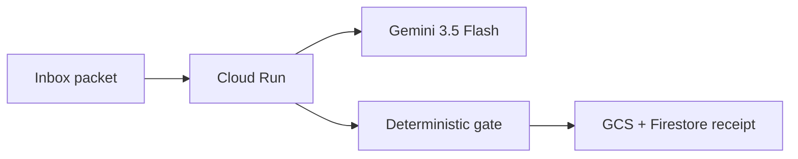

# Night Clerk

Overnight research-inbox agent for the **All Things Agentic Hackathon 2026**, track **Taskmaster**.

It does not chat. It takes an inbox packet, labels claims, rejects fake validation, and writes a receipt.

Built with **Gemini 3.5 Flash**, **Google ADK**, **Cloud Run**, **Cloud Storage**, and **Firestore**.

## Why this exists

A research desk accumulates notes, literature sentences, and simulation remarks. People then treat a mesh check as proof. Night Clerk runs that pile as a job and leaves a receipt a human can review in the morning.

## Five-minute dry run (no cloud, no key)

Python 3.11+:

```powershell
python -m venv .venv
.\.venv\Scripts\Activate.ps1
pip install -e .[dev]
pytest
python -m night_clerk.cli run --packet fixtures\inbox\overvoltage-inbox.json
```

The fixture contains one sentence that claims scientific validation from a mesh check. The clerk **rejects** it.

## Architecture

See [docs/architecture.md](docs/architecture.md).



## Register and credits

1. [Join the hackathon](https://allthingsagentichackathon.devpost.com/)
2. Paste [docs/CREDIT_FORM.md](docs/CREDIT_FORM.md) into the $150 credit form **before 28 Aug 12:00 PT**
3. Follow [docs/SETUP.md](docs/SETUP.md)

This repository is new work for the hackathon. It is not a resubmission of `scientific-llm-orchestrator`.
