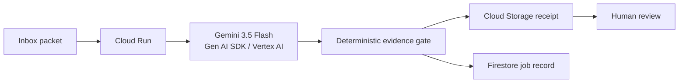

# Night Clerk

Night Clerk is a job-style research-inbox agent for the **All Things Agentic Hackathon 2026**, category **Taskmaster**.

It does not chat. It takes a messy inbox packet, asks Gemini to classify the evidence type of each claim, applies a deterministic scientific-safety gate, and writes a receipt for human review.

Built with **Gemini 3.5 Flash**, **Google Gen AI SDK**, **Google ADK**, **Cloud Run**, **Cloud Storage**, and **Firestore**.

## The friction

A research desk accumulates notes, literature sentences, simulation remarks, and quick engineering checks. The dangerous failure mode is not missing text — it is silently upgrading weak evidence into a scientific conclusion. A mesh check can prove a mesh was checked; it cannot scientifically validate the underlying model.

Night Clerk turns that pile into a bounded overnight-style job. Gemini handles ambiguous evidence classification. Deterministic code owns the final accept/hold/reject decision. The output is a receipt a human can audit the next morning.

## Five-minute local dry-run

Python 3.11+:

```powershell
git clone https://github.com/ttthkim-hue/night-clerk.git
cd night-clerk
python -m venv .venv
.\.venv\Scripts\Activate.ps1
pip install -e .[dev]
pytest
python -m night_clerk.cli run --packet fixtures\inbox\overvoltage-inbox.json
```

The local path is intentionally credential-free and does not call Gemini. The bundled public fixture includes a sentence claiming that a mesh check scientifically validates a CFD result; the deterministic gate **rejects** that claim.

## Cloud demo

The contest deployment path runs the FastAPI service on Cloud Run, calls **Gemini 3.5 Flash through the Google Gen AI SDK on Vertex AI**, and writes receipts to Cloud Storage plus compact job state to Firestore.

After deployment, open the Cloud Run root URL and press **Run public demo packet**. The page posts a synthetic packet to `/jobs` and renders the persisted job receipt returned by the live backend.

Cloud deployment instructions: [`docs/SETUP.md`](docs/SETUP.md).

## Architecture

See [`docs/architecture.md`](docs/architecture.md).



### Authority boundary

- Gemini proposes a label from a closed evidence-label set.
- Protected literals are held.
- Numeric claims that remain unverified are held.
- "Mesh/smoke/compile/visualization success therefore scientifically validated" is rejected.
- Only `gate.py` can accept, hold, or reject a claim.
- Night Clerk writes a receipt; it does not autonomously alter a manuscript or approve a scientific conclusion.

## Contest stack mapping

| Requirement | Implementation |
|---|---|
| Gemini 3.5+ | `gemini-3.5-flash` via Google Gen AI SDK |
| Google agent framework | Google Gen AI SDK; bounded ADK root agent is also provided in `agent.py` |
| Google Cloud infrastructure | Cloud Run + Cloud Storage + Firestore |
| Reproducible setup | this README + `docs/SETUP.md` |
| Architecture diagram | README + `docs/architecture.md` |
| Public-safe demo data | `fixtures/inbox/overvoltage-inbox.json` |

## Submission material

- Devpost write-up: [`docs/DEVPOST.md`](docs/DEVPOST.md)
- Final gate and video storyboard: [`docs/SUBMISSION_CHECKLIST.md`](docs/SUBMISSION_CHECKLIST.md)

## Project lineage disclosure

This repository and contest implementation were created during the 2026 All Things Agentic submission period. The problem framing is informed by earlier work on scientific evidence labeling and agent orchestration, including `scientific-llm-orchestrator`; Night Clerk is a separate contest implementation and is not a resubmission of that repository.

## Privacy and safety

The bundled fixture is synthetic and public-safe. Do not put private research data, credentials, account identifiers, service-account keys, or raw private inbox content in the repository or public demo.
