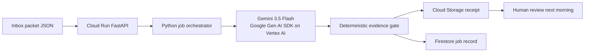

# Architecture

Night Clerk is a **Taskmaster** workflow: a job comes in, the system classifies evidence, applies a deterministic safety gate, persists a receipt, and stops. There is no conversational loop in the product path.

## Required stack mapping

| Contest requirement | Night Clerk implementation |
|---|---|
| Gemini 3.5 or newer | `gemini-3.5-flash` in `pipeline.py`, called through the Google Gen AI SDK |
| Google agent framework | Google Gen AI SDK in `labeler.py`; an ADK `Agent` exposing the same bounded workflow tools is defined in `agent.py` |
| Google Cloud infrastructure | Cloud Run API/UI + Cloud Storage receipts + Firestore job records |

The deployed HTTP path calls Gemini through the **Google Gen AI SDK on Vertex AI**. `src/night_clerk/agent.py` also defines an ADK root agent with two bounded tools (`list_fixture_packets`, `run_night_shift`) for ADK-compatible execution; the deterministic Python orchestrator remains the product source of truth.

## Authority split

1. Gemini proposes one evidence label from a closed label set.
2. `gate.py` is the only component that can accept, hold, or reject a claim.
3. A protected literal is held for human review.
4. A numeric claim that remains unverified is held.
5. A statement that treats a mesh check, smoke test, compile, or visualization success as scientific validation is rejected.
6. The receipt is persisted; Night Clerk does not edit a manuscript or promote a scientific conclusion.

This separation is deliberate: the model handles ambiguous classification while deterministic code owns the irreversible scientific-safety decision.

## State and failure behavior

- `NIGHT_CLERK_MODE=local` writes JSON under `.night-clerk/` and does **not** call Gemini. Tests and the credential-free dry-run use this path.
- `NIGHT_CLERK_MODE=gcp` writes a receipt to Cloud Storage and a compact job record to Firestore.
- Cloud mode is configured for Vertex AI with Application Default Credentials. It fails closed if a Gemini transport is not configured instead of silently presenting a deterministic-only run as a Gemini-backed run.
- The public fixture is synthetic and contains no private research data.
