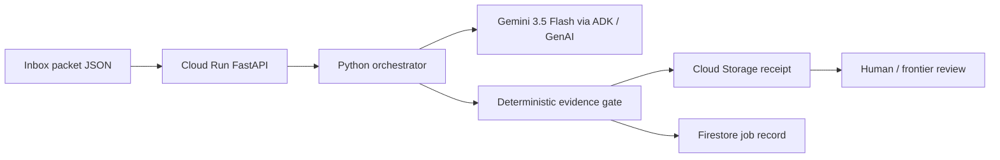

# Architecture

Night Clerk is a Taskmaster workflow: a job comes in, tools run, a receipt is written. There is no chat loop in the product path.

## Required stack

| Requirement | Where |
|---|---|
| Gemini 3.5 or newer | `NIGHT_CLERK_MODEL=gemini-3.5-flash` in `labeler.py` and `agent.py` |
| Google agent framework | Google ADK `Agent` in `src/night_clerk/agent.py` plus Google GenAI SDK |
| Google Cloud service | Cloud Run service + Cloud Storage + Firestore |

## Authority split

- Gemini proposes an evidence label.
- `gate.py` is the only path that can accept, hold, or reject.
- The clerk never applies a scientific conclusion to a manuscript.
- Numeric claims without a label are held.
- "Mesh check / smoke test therefore validated" is rejected.

## Local vs cloud

`NIGHT_CLERK_MODE=local` writes JSON under `.night-clerk/` and does not call Gemini. Tests use this path.

`NIGHT_CLERK_MODE=gcp` writes `gs://` receipts and Firestore documents.
